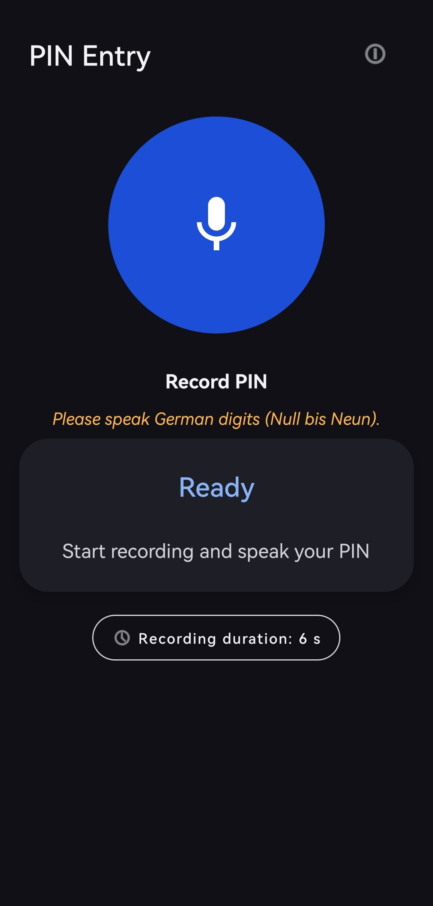
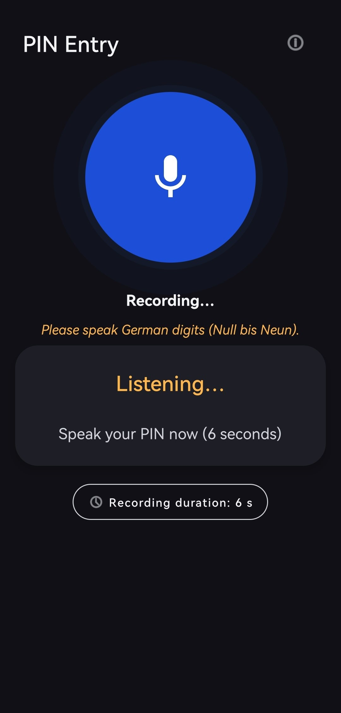
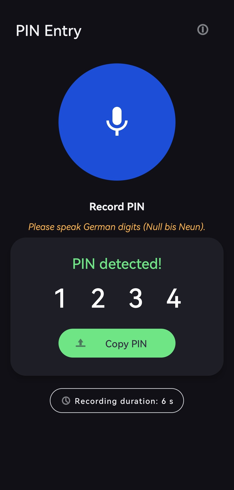

# DigitVoice — Offline Speech-to-PIN for Android

[](https://developer.android.com)
[](https://kotlinlang.org)
[](https://github.com/oreZ74/android-speech-digits/actions)
[](LICENSE)
[](https://ai.google.dev/edge/litert)
[](https://python.org)

> **Speak a PIN. Offline. On-device. No cloud, no latency, no privacy trade-offs.**

**DigitVoice** is a production-grade Android app that recognizes **spoken German digits
(0–9)** entirely on-device. A 4-second voice recording is segmented via WebRTC-based
Voice Activity Detection, classified with a custom CNN running on LiteRT (TensorFlow Lite),
and assembled into a 4-digit PIN. Built as a Bachelor thesis project and refined into a
public portfolio piece.

---

## Features

- **100% Offline** – All inference runs locally via LiteRT. No internet connection required.
- **WebRTC VAD** – Accurate speech segmentation with onset backtracking, RMS hysteresis
  gating, and automatic fallback to less aggressive modes.
- **Multi-Candidate Normalization** – Each segment is classified from up to 7
  positional candidates (start/center/end/peak-aligned), best selected by inference.
- **WCAG 2.1 AA Accessibility** – Full TalkBack support, Live Region announcements,
  hardware volume-key shortcuts, font-scale adaptive layout.
- **Theme & Language Switching** – Dark/Light/System theme toggle and in-app language
  picker (German / English / System) with runtime `AppCompatDelegate` integration.
- **MVVM Architecture** – `MainViewModel` + `StateFlow<UiState>` survives configuration
  changes (screen rotation).
- **SHA-256 Model Verification** – The TFLite model fingerprint is checked at load time.
- **24 Unit Tests** – Covering audio preprocessing, VAD thresholds, and state management.

### Demo Screenhots

<p align="center">
  
  
  
</p>

---

## Project Status & Compatibility (Technical Demo)

This repository serves as a **functional technical preview**. The Kotlin audio pipeline, WebRTC VAD gating, and core model processing are all fully implemented and verified.

### Verified Compatibility

| Environment                       | OS / API Level                | Architecture         | Status               |
| --------------------------------- | ----------------------------- | -------------------- | -------------------- |
| **Huawei Mate 20 Pro** (Physical) | EMUI 12 (Android 10 / API 29) | ARM64 (4 KB pages)   | **Passed**           |
| **Android 14 Emulator**           | Android 14 (API 34)           | x86_64 (4 KB pages)  | **Passed**           |
| **Android 15 Emulator**           | Android 15 (API 35/36)        | x86_64 (16 KB pages) | **Known limitation** |

### ⚠️ Android 15 Compatibility Note (16 KB Pages)

- **Issue:** The app crashes (`SIGSEGV`) strictly on modern Android 15 emulators with 16 KB memory pages. This is caused by legacy TensorFlow Lite Flex-Ops binaries being hard-aligned to 4 KB segments.
- **Workaround:** Run the app on physical devices (e.g., Android 10+), standard 4 KB emulators (API ≤ 34), or test environments with default page sizing.
- **Permanent Fix:** Will be resolved in the upcoming architecture overhaul by dropping Flex-Ops entirely and migrating to a pure, native LiteRT pipeline.

---

## Architecture & Core Components

```
┌─────────────────────────────────────────┐
│ MainActivity (View)                     │
│  observes MainViewModel.uiState         │
├─────────────────────────────────────────┤
│ MainViewModel (AndroidViewModel)        │
│  owns PinEntryController, StateFlow     │
├─────────────────────────────────────────┤
│ PinEntryController                      │
│  coordinates AudioRecord + classifyPin  │
├─────────────────────────────────────────┤
│ RawDigitClassifier (Facade)             │
│  ┝ TfliteModelLoader (model lifecycle)  │
│  ┝ AudioPreprocessor (PCM16 processing) │
│  ┝ WebRtcVadSegmenter (WebRTC VAD)      │
│  ┕ PinAssemblyEngine (VAD + best-4)     │
└─────────────────────────────────────────┘
```

---

## Model

| Property | Value |
|---|---|
| **Architecture** | Raw waveform → in-graph MFCC → Conv2D → Dense → Softmax(12) |
| **Input Shape** | 16 kHz mono PCM, 1.0 s (16,000 samples Float32) |
| **Outputs** | 12-class probabilities (Digits 0–9, `_silence_`, `_unknown_`) |
| **Model Size** | ~1.6 MB (Float32 uncompressed) |
| **Accuracy** | 97.95% test accuracy on Speaker-Independent Split (Heidelberg Digits) |
| **Inference Engine**| TensorFlow Lite (org.tensorflow:tensorflow-lite:2.16.1) |                                      |

---

## Quick Start

### Android App (Kotlin, MVVM, Material 3)
The pre-trained model (`models/tflite/digits_rawwave_12cls.tflite`) is already bundled inside `app/src/main/assets/`. No additional setup required.

```bash
cd android_app
./gradlew installDebug       # Builds and installs on connected device/emulator
./gradlew test                # Runs the 24 local JVM unit tests
```

### Python Training Pipeline (optional)

```bash
python -m venv venv
source venv/bin/activate
pip install -r requirements.txt
export PYTHONPATH="$PWD/python/digit_pipeline"
python -m digit_pipeline.scripts.smoke_check
```

---

## Datasets

Audio data is **not included** due to licensing. To retrain the model, download:

| Dataset                | Purpose               | Directory                     | Source                                                                          |
| ---------------------- | --------------------- | ----------------------------- | ------------------------------------------------------------------------------- |
| Heidelberg Digits      | Training (German 0–9) | `data/raw/hd_audio/`          | [zenkelab.org](https://zenkelab.org/resources/spiking-heidelberg-datasets-shd/) |
| Google Speech Commands | `_unknown_` class     | `data/raw/speech_commands/`   | [TF Datasets](https://www.tensorflow.org/datasets/catalog/speech_commands)      |
| MyDigits (custom)      | Domain adaptation     | `data/raw/manual_recordings/` | Recorded via the app                                                            |

After training, copy the exported model:

```bash
cp python/digit_pipeline/outputs/training/tflite/digits_rawwave_12cls.tflite \
   android_app/app/src/main/assets/
```

---

## Future Roadmap & Upcoming Overhaul

A comprehensive architecture overhaul is planned for the next development cycle to transition from legacy TensorFlow Lite structures to Google's modern **LiteRT** runtime, ensuring out-of-the-box Android 15 (16 KB page) compatibility.

- **Pure LiteRT Migration:** Replace all legacy `org.tensorflow` dependencies with the modern `com.google.ai.edge.litert` namespace to leverage Google's forward-looking Android ML stack.
- **Zero-Flex Pipeline Architecture:** Strip `FlexStridedSlice` operators from the model by moving audio boundary windowing entirely into the native Kotlin `AudioPreprocessor`. Re-exporting the Keras graph without custom ops eliminates the heavy `select-tf-ops` binary payload (~5 MB), cutting down APK size and permanently resolving the 16 KB page `SIGSEGV`.
- **English Vocabulary & Augmentation:** Extend the Keras pipeline to classify both German and English digits within a unified model. Inject automated data augmentation (speed perturbation, noise mixing) directly into the training pipeline to maximize real-world robustness.

---

## Credits

- **Author:** [oreZ74](https://github.com/oreZ74)
- **Datasets:** [Heidelberg Digits](https://zenkelab.org/resources/spiking-heidelberg-datasets-shd/) · [Google Speech Commands](https://www.tensorflow.org/datasets/catalog/speech_commands)
- **License:** [MIT](LICENSE)
